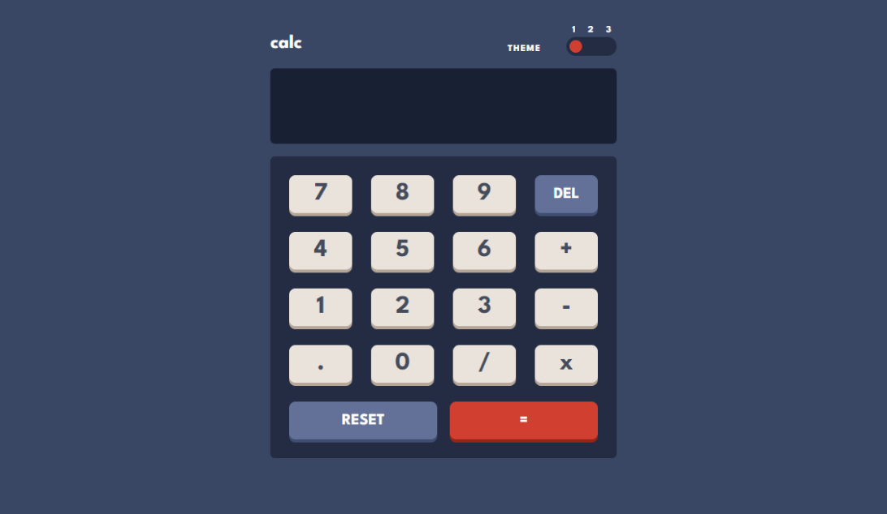

## Table of contents

- [Overview](#overview)
  - [The challenge](#the-challenge)
  - [Screenshot](#screenshot)
  - [Links](#links)
- [My process](#my-process)
  - [Built with](#built-with)
  - [What I learned](#what-i-learned)
  - [Continued development](#continued-development)
- [Author](#author)

**Note: Delete this note and update the table of contents based on what sections you keep.**

## Overview

### The challenge

Users should be able to:

- See the size of the elements adjust based on their device's screen size
- Perform mathmatical operations like addition, subtraction, multiplication, and division
- Adjust the color theme based on their preference
- **Bonus**: Have their initial theme preference checked using `prefers-color-scheme` and have any additional changes saved in the browser

### Screenshot



### Links

- Solution URL: [https://calculator-app-pink-sigma.vercel.app/]
- Live Site URL: [https://calculator-app-pink-sigma.vercel.app/]

## My process

### Built with

- Semantic HTML5 markup
- CSS custom properties
- Flexbox
- CSS Grid
- Mobile-first workflow
- [React](https://reactjs.org/) - JS library
- [Tailwind CSS](https://tailwindcss.com/) - CSS Framework for styles
- [Typescript](https://www.typescriptlang.org/) - Types for JS

### What I learned

In this project, I run into many difficulties that I hope to have successfully overcome.

One of them was using all the styles given in the challenge, which also had to respond to three different themes. In my case, I had decided to use Tailwind CSS before starting the challenge. This is a CSS framework that adds styles through utility classes. These, in turn, can be applied to CSS classes. Therefore, I thought of taking advantage of the React environment and placing conditions in JavaScript code within my component classes. Thus, I created a set of classes for each theme, and with template literals, I interpolated the state of my current theme to switch from one class to another.

Another challenge was the code for the operations, from which I took help from a YouTube channel, TavCode, to guide me at the beginning. The main difficulty, I think, was how to perform effective operations between strings and numbers in a React state, without giving unpleasant errors (for example, "1" + "2" = "12").

Additionally, I had to use four different types of buttons, each with their own unique classes and functions. To simplify the code and avoid creating multiple components, I suggest implementing an if-else statement within the existing Button component to conditionally render the different button types. The code below shows the implementation I used.

```js
if (reset) {
  return (
    <button
      className={`btn-xl btn-del-${theme} btn-del-shadow-${theme}`}
      onClick={() => setDisplay("")}
    >
      {label}
    </button>
  );
} else if (del) {
  return (
    <button
      className={`btn-xl btn-del-${theme} btn-del-shadow-${theme}`}
      onClick={handleDelete}
    >
      {label}
    </button>
  );
} else if (result) {
  return (
    <button
      className={`btn-xl btn-result-${theme} btn-result-shadow-${theme}`}
      onClick={calcResult}
    >
      {label}
    </button>
  );
} else if (operation) {
  return (
    <button
      className={`btn btn-${theme} btn-shadow-${theme}`}
      onClick={() => display.length >= 1 && addSymbol(` ${value} `)}
    >
      {label}
    </button>
  );
} else {
  return (
    <button
      className={`btn btn-${theme} btn-shadow-${theme}`}
      onClick={() => setDisplay(display + value)}
    >
      {label}
    </button>
  );
}
```

### Continued development

The application works very well. I'm interested in finishing the bonus exercise that adds a preferred-theme to the calculator and save it in the browser.

## Author

- Website - [Maximiliano Leonel Pérez](https://maxoleo-dev.vercel.app/)
- Frontend Mentor - [@MaximilianoLeonel23](https://www.frontendmentor.io/profile/MaximilianoLeonel23)
- Linkedin - [Maximiliano Leonel Pérez](https://www.linkedin.com/in/maximiliano-leonel-p%C3%A9rez-8846b826a/)
